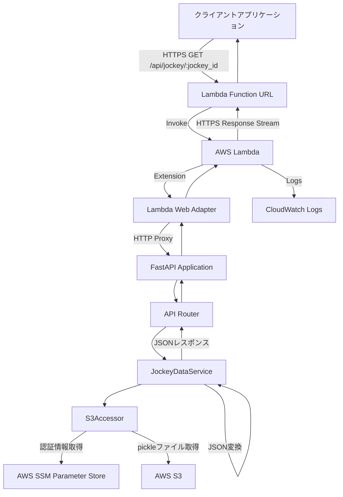
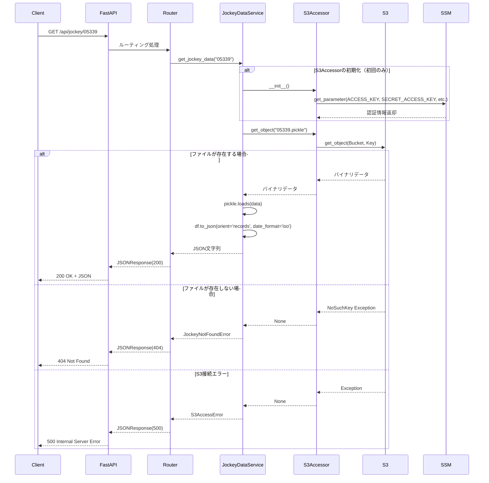
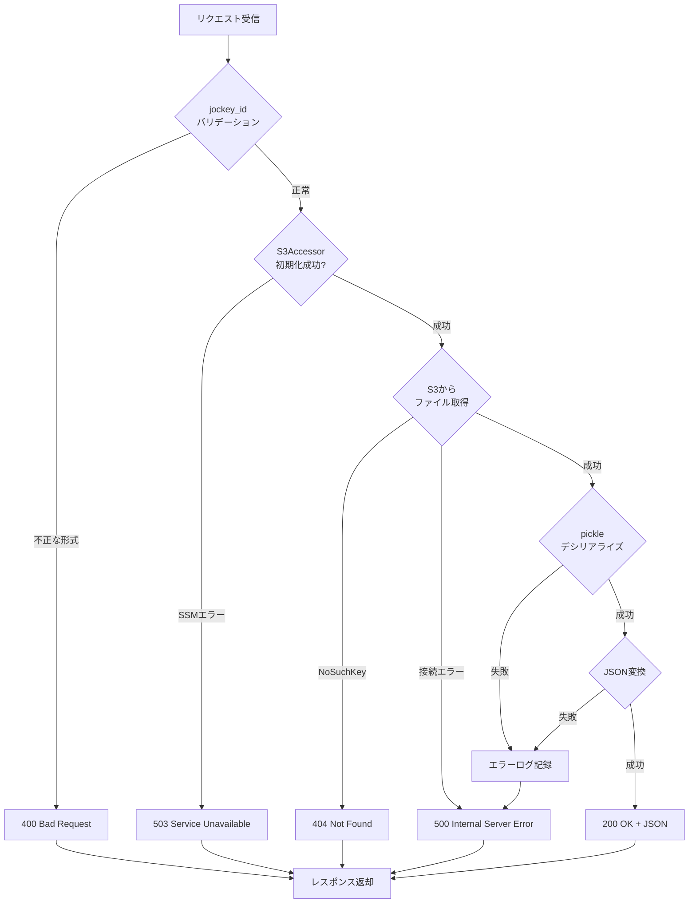
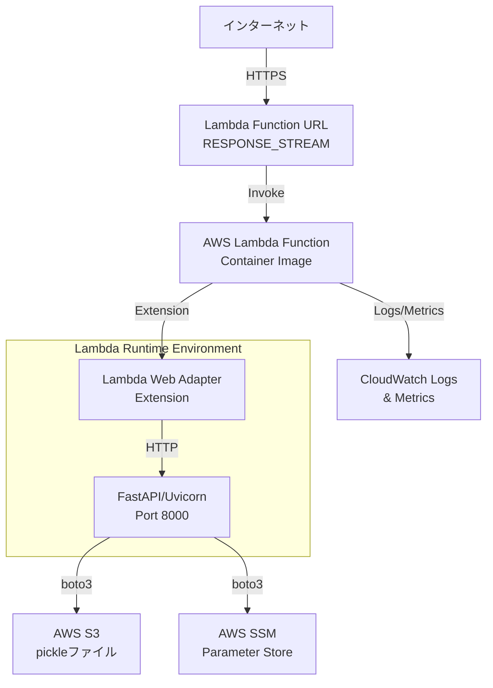
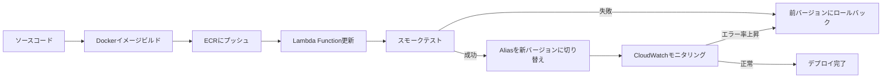

# 技術設計書

## Overview

本機能は、騎手IDをパラメータとして受け取り、AWS S3から対応するpickleファイル（pandas DataFrame）を取得してJSON形式で返却するREST APIサーバーを提供します。既存の`S3Accessor`クラスと`pickle_to_csv.py`のデータ変換ロジックを活用し、軽量で高性能なAPIエンドポイントを構築します。

**Purpose**: 競馬データの騎手情報をフロントエンドやデータ分析ツールから容易に取得できるようにし、データの再利用性と可用性を向上させる。

**Users**: Webアプリケーション、モバイルアプリケーション、データ分析ツール、ダッシュボードシステムなどのクライアントアプリケーション。

**Impact**: 現在ローカルファイルベースで動作している騎手データ処理を、HTTP API経由でアクセス可能なサービスに変換することで、複数のクライアントからの同時アクセスとデータ共有を可能にします。

### Goals
- 騎手IDをパスパラメータとして受け取るREST APIエンドポイントの提供
- AWS S3からのpickleファイル取得と自動デシリアライズ
- pandas DataFrameからJSON形式への効率的な変換
- 適切なHTTPステータスコードとエラーハンドリング

### Non-Goals
- 騎手データの作成・更新・削除機能（本バージョンでは読み取り専用）
- 認証・認可機能（将来的な拡張として検討）
- ページネーション機能（DataFrameを全件返却）
- WebSocket等のリアルタイム通信

## Architecture

### 既存アーキテクチャ分析

現在のプロジェクトは以下の構造を持ちます:
- **S3Accessor**: AWS SSM Parameter StoreからS3認証情報を取得し、S3操作を提供
- **pickle_to_csv.py**: pickleファイルをCSVに変換するユーティリティスクリプト
- **pyproject.toml**: pandas >=2.3.3に依存

既存の`S3Accessor`クラスは再利用可能で、以下の機能を提供します:
- SSM Parameter Storeからの設定取得（`ACCESS_KEY`, `SECRET_ACCESS_KEY`, `REGION_NAME`, `BUCKET_NAME`）
- `get_object(key)`メソッドによるS3からのバイナリデータ取得
- エラーハンドリング（例外キャッチとログ出力）

### High-Level Architecture



### 技術スタック整合性

既存の技術スタックとの整合性を考慮し、以下の技術を採用します:

**Backend Framework**: FastAPI
- **選定理由**: Python 3.13.2と互換性があり、型ヒントをフルサポート。高性能（3,000+ RPS）で自動的なOpenAPI/Swagger UIドキュメント生成が可能。
- **既存技術との整合**: pandasとの統合が容易で、非同期処理をサポート。
- **新規依存関係**: `fastapi`、`uvicorn`（ASGIサーバー）

**Data Processing**: Pandas (既存)
- 既に`pyproject.toml`に定義済み（pandas>=2.3.3）
- DataFrame → JSON変換に`df.to_json()`を使用

**AWS SDK**: boto3 (既存)
- `S3Accessor`クラスで既に使用中
- 変更なし、そのまま再利用

**Configuration**: 環境変数 + AWS SSM Parameter Store (既存パターン)
- `S3Accessor`の既存パターンを踏襲
- `AWS_REGION`環境変数を使用

### 主要な設計決定

#### 決定1: FastAPIの採用

**Decision**: FastAPIをWebフレームワークとして採用

**Context**: 軽量なREST APIサーバーが必要で、既存のPython 3.13環境で動作し、pandas DataFrameをJSON形式で効率的に返却する必要がある。

**Alternatives**:
1. **Flask + Flask-RESTful**: 成熟したフレームワークだが、型ヒントサポートが弱く、手動でのバリデーションが必要。
2. **Django REST Framework**: 大規模アプリケーション向けで、シンプルなAPIには過剰な機能とオーバーヘッドがある。
3. **FastAPI**: 型ヒントベースのバリデーション、高速、自動ドキュメント生成。

**Selected Approach**: FastAPI + Uvicorn（ASGIサーバー）
- パスパラメータの型検証を自動化（例: `jockey_id: str`）
- 自動的なOpenAPI仕様とSwagger UI生成
- pandasとの統合が容易（`JSONResponse`で返却）

**Rationale**:
- Python 3.13.2の型ヒント機能を最大限活用
- 開発速度が速く、コード量を削減（Flask比で40%削減）
- 非同期処理に対応しており、将来的なスケーリングが容易

**Trade-offs**:
- **獲得**: 型安全性、自動バリデーション、自動ドキュメント、高性能
- **犠牲**: Flaskほどの成熟度はないが、2025年時点で十分に安定

#### 決定2: 既存S3Accessorクラスの再利用

**Decision**: `s3_accessor.py`の`S3Accessor`クラスをそのまま再利用

**Context**: S3からのデータ取得とSSM Parameter Store統合の実装が既に存在する。

**Alternatives**:
1. **新規実装**: boto3を直接使用して新しいS3クライアントを実装
2. **S3Accessorの拡張**: 既存クラスに新しいメソッドを追加
3. **そのまま再利用**: 既存の`get_object(key)`メソッドを使用

**Selected Approach**: 既存の`get_object(key)`メソッドをそのまま使用
- `jockey_id`から`{jockey_id}.pickle`のキー名を生成
- `get_object(key)`でバイナリデータを取得
- pickleモジュールでデシリアライズ

**Rationale**:
- 既存の認証フロー（SSM Parameter Store）を変更せずに利用可能
- エラーハンドリングロジックが既に実装されている
- 追加の学習コストやテストコストがゼロ

**Trade-offs**:
- **獲得**: 実装時間の短縮、既存の安定した実装の活用
- **犠牲**: `S3Accessor`の初期化オーバーヘッド（SSM Parameter Store呼び出し）があるが、本ユースケースでは許容範囲

#### 決定3: DataFrame全件返却（ページネーションなし）

**Decision**: DataFrameを全件JSON変換して返却し、ページネーション機能は実装しない

**Context**: 騎手の過去レースデータは数百〜数千行程度で、クライアント側で全データを必要とするユースケースが想定される。

**Alternatives**:
1. **ページネーション実装**: `limit`と`offset`パラメータでデータを分割
2. **全件返却**: DataFrameをそのままJSON化
3. **圧縮レスポンス**: gzip圧縮を有効化

**Selected Approach**: 全件返却 + FastAPIの自動圧縮（Content-Encodingヘッダー）
- `df.to_json(orient='records', date_format='iso')`で全件変換
- レスポンスサイズが大きい場合は自動的にgzip圧縮

**Rationale**:
- 要件定義にページネーションの記載がない
- 初期バージョンではシンプルさを優先
- 将来的な拡張として追加可能（クエリパラメータで実装）

**Trade-offs**:
- **獲得**: シンプルな実装、クライアント側の実装負担軽減
- **犠牲**: 大規模データの場合にネットワーク帯域を消費（ただし、想定データサイズは許容範囲）

## System Flows

### APIリクエストフロー



### エラーハンドリングフロー



## Requirements Traceability

| 要件ID | 要件概要 | 実現コンポーネント | インターフェース | フロー参照 |
|--------|----------|-------------------|-----------------|-----------|
| 1.1 | `/api/jockey/{jockey_id}` GETエンドポイント | FastAPI Router, JockeyDataService | `GET /api/jockey/{jockey_id}` | APIリクエストフロー |
| 1.2 | jockey_idをファイル名として使用 | JockeyDataService | `get_jockey_data(jockey_id: str)` | APIリクエストフロー |
| 1.3 | 存在しないIDで404返却 | JockeyDataService, Exception Handler | `JockeyNotFoundError` → 404 | エラーハンドリングフロー |
| 1.4 | 正常時に200 + JSON返却 | JockeyDataService, FastAPI Response | `JSONResponse(status_code=200)` | APIリクエストフロー |
| 2.1 | S3からpickleファイル取得 | S3Accessor | `get_object(key: str)` | APIリクエストフロー |
| 2.2 | S3取得失敗時に500返却 | Exception Handler | `S3AccessError` → 500 | エラーハンドリングフロー |
| 2.3 | S3認証失敗時に503返却 | S3Accessor, Exception Handler | SSM初期化エラー → 503 | エラーハンドリングフロー |
| 2.4 | 環境変数から設定読み込み | S3Accessor | `os.environ.get("AWS_REGION")` | APIリクエストフロー |
| 3.1 | pickleデシリアライズ | JockeyDataService | `pickle.loads(data)` | APIリクエストフロー |
| 3.2 | DataFrameをJSON変換 | JockeyDataService | `df.to_json(orient='records', date_format='iso')` | APIリクエストフロー |
| 3.3 | デシリアライズ失敗時に500 | Exception Handler | `PickleDeserializeError` → 500 | エラーハンドリングフロー |
| 3.4 | 日付をISO 8601形式に変換 | pandas to_json | `date_format='iso'` パラメータ | APIリクエストフロー |
| 4.1 | エラー内容をログ記録 | Logging Middleware | `logger.error()` | エラーハンドリングフロー |
| 4.2 | S3エラー詳細をログ記録 | S3Accessor | `logger.error(f"Bucket: {bucket}, Key: {key}")` | エラーハンドリングフロー |
| 4.3 | 内部詳細を露出しない | Exception Handler | カスタムエラーレスポンス | エラーハンドリングフロー |
| 4.4 | 予期しない例外で500返却 | Global Exception Handler | `500 Internal Server Error` | エラーハンドリングフロー |
| 5.1 | キャッシュ可能な設計 | FastAPI Dependency Injection | S3Accessorシングルトン化 | - |
| 5.2 | CORSヘッダー返却 | FastAPI CORSMiddleware | `allow_origins=["*"]` | - |
| 5.3 | 環境変数ベース認証 | S3Accessor | SSM Parameter Store統合 | APIリクエストフロー |
| 5.4 | レート制限可能な設計 | FastAPI Middleware | Slowapi統合（将来拡張） | - |

## Components and Interfaces

### API Layer

#### FastAPI Application

**Responsibility & Boundaries**
- **Primary Responsibility**: HTTPリクエストの受付、ルーティング、レスポンスの返却
- **Domain Boundary**: APIレイヤー（HTTPプロトコルとビジネスロジックの境界）
- **Data Ownership**: HTTPリクエスト/レスポンスのライフサイクル
- **Transaction Boundary**: 単一HTTPリクエストスコープ

**Dependencies**
- **Inbound**: クライアントアプリケーション（Webブラウザ、モバイルアプリ、データ分析ツール）
- **Outbound**: JockeyDataService（ビジネスロジック層）
- **External**: FastAPI（フレームワーク）、Uvicorn（ASGIサーバー）

**Contract Definition**

**API Contract**:
| Method | Endpoint | Request | Response | Errors |
|--------|----------|---------|----------|--------|
| GET | `/api/jockey/{jockey_id}` | PathParameter: `jockey_id: str` | `200 OK`: JSON配列 | `400`: 不正なリクエスト<br/>`404`: 騎手が見つからない<br/>`500`: サーバーエラー<br/>`503`: S3サービス利用不可 |

**Request Schema**:
```typescript
// パスパラメータ
interface PathParams {
  jockey_id: string; // 例: "05339"
}
```

**Response Schema (200 OK)**:
```typescript
// JSONレスポンス（pandas DataFrameのレコード配列）
interface JockeyDataResponse {
  data: RaceRecord[];
}

interface RaceRecord {
  日付: string;           // ISO 8601形式（例: "2024-09-29T00:00:00Z"）
  開催: string;           // 例: "船橋"
  "天 気": string;        // 例: "晴"
  R: number;              // レース番号
  レース名: string;       // 例: "スプリンターズS(GI)"
  映像: string | null;
  "頭 数": number;
  "枠 番": number;
  "馬 番": number;
  単勝: number;
  "人 気": number;
  "着 順": number;
  馬名: string;
  騎手: string;
  斤量: number;
  距離: string;           // 例: "芝1200"
  水分量: number;
  "馬 場": string;        // 例: "良"
  タイム: string;         // 例: "1:07.2"
  着差: string | number;
  通過: string;
  ペース: string;
  上り: string;
  馬体重: string;
  勝ち馬: string;
  "賞金 (万円)": number;
  page_number: number;
  jockey_id: string;
}
```

**Error Response Schema**:
```typescript
interface ErrorResponse {
  detail: string;  // エラーメッセージ（内部詳細は含まない）
}

// 例:
// 404: {"detail": "Jockey with ID '05339' not found"}
// 500: {"detail": "Internal server error"}
// 503: {"detail": "S3 service unavailable"}
```

**Preconditions**:
- `jockey_id`は文字列形式であること（FastAPIが自動検証）
- AWS SSM Parameter Storeに必要なパラメータが設定されていること

**Postconditions**:
- 成功時、完全なJSON配列がレスポンスボディに含まれる
- 失敗時、適切なHTTPステータスコードとエラーメッセージが返却される

**Invariants**:
- 同一の`jockey_id`に対しては常に同一のデータが返却される（S3のデータが変更されない限り）
- レスポンスは常にJSONフォーマット

#### API Router

**Responsibility & Boundaries**
- **Primary Responsibility**: エンドポイントのルーティングとリクエスト/レスポンスのマッピング
- **Domain Boundary**: HTTPレイヤーとサービスレイヤーの橋渡し
- **Data Ownership**: パスパラメータの抽出と検証
- **Transaction Boundary**: リクエストスコープ

**Dependencies**
- **Inbound**: FastAPI Application
- **Outbound**: JockeyDataService
- **External**: FastAPI Router

**Contract Definition**

**Service Interface**:
```typescript
// Routerの責務
interface JockeyRouter {
  get_jockey_by_id(jockey_id: string): Promise<Response>;
}
```

**実装イメージ**:
```python
from fastapi import APIRouter, HTTPException, Depends
from app.services.jockey_data_service import JockeyDataService
from app.models.exceptions import JockeyNotFoundError, S3AccessError

router = APIRouter(prefix="/api/jockey", tags=["jockey"])

@router.get("/{jockey_id}")
async def get_jockey_by_id(jockey_id: str, service: JockeyDataService = Depends()):
    """
    指定された騎手IDのレースデータを取得

    - **jockey_id**: 騎手ID（例: 05339）
    """
    try:
        data = service.get_jockey_data(jockey_id)
        return {"data": data}
    except JockeyNotFoundError as e:
        raise HTTPException(status_code=404, detail=str(e))
    except S3AccessError as e:
        raise HTTPException(status_code=500, detail="Failed to access S3")
    except Exception as e:
        logger.error(f"Unexpected error: {e}")
        raise HTTPException(status_code=500, detail="Internal server error")
```

**Preconditions**: `jockey_id`がパスから抽出可能であること

**Postconditions**: サービス層の戻り値をHTTPレスポンスに変換

**Invariants**: 例外は必ずHTTPExceptionに変換される

### Service Layer

#### JockeyDataService

**Responsibility & Boundaries**
- **Primary Responsibility**: 騎手データの取得、デシリアライズ、JSON変換のビジネスロジック
- **Domain Boundary**: データアクセス層とAPI層の仲介
- **Data Ownership**: pickleデータのデシリアライズとJSON変換プロセス
- **Transaction Boundary**: 単一データ取得操作

**Dependencies**
- **Inbound**: API Router
- **Outbound**: S3Accessor（データアクセス層）
- **External**: pandas、pickle、logging

**External Dependencies Investigation**:
- **pandas**: DataFrame操作とJSON変換に使用
  - 使用メソッド: `pd.read_pickle()`, `df.to_json(orient='records', date_format='iso')`
  - バージョン: >=2.3.3（pyproject.toml指定）
  - 互換性: Python 3.13.2と互換性確認済み
- **pickle**: Pythonネイティブのシリアライゼーションライブラリ
  - 使用メソッド: `pickle.loads(data)`
  - セキュリティ考慮: 信頼できるソース（S3）からのデータのみデシリアライズ

**Contract Definition**

**Service Interface**:
```typescript
interface JockeyDataService {
  get_jockey_data(jockey_id: string): Result<RaceRecord[], ServiceError>;
}

// Result型（エラーハンドリング）
type Result<T, E> =
  | { success: true; data: T }
  | { success: false; error: E };

// エラー型定義
type ServiceError =
  | JockeyNotFoundError    // 404相当
  | S3AccessError          // 500相当
  | PickleDeserializeError // 500相当
  | SSMConfigError;        // 503相当
```

**実装イメージ**:
```python
from typing import List, Dict
import pickle
import pandas as pd
from app.infrastructure.s3_accessor import S3Accessor
from app.models.exceptions import JockeyNotFoundError, S3AccessError, PickleDeserializeError

class JockeyDataService:
    def __init__(self, s3_accessor: S3Accessor):
        self.s3_accessor = s3_accessor

    def get_jockey_data(self, jockey_id: str) -> List[Dict]:
        """
        騎手IDに基づいてS3からデータを取得し、JSON形式で返却

        Args:
            jockey_id: 騎手ID（例: "05339"）

        Returns:
            レースデータのリスト（dictの配列）

        Raises:
            JockeyNotFoundError: 指定された騎手のデータが存在しない
            S3AccessError: S3アクセスエラー
            PickleDeserializeError: pickleデシリアライズエラー
        """
        key = f"{jockey_id}.pickle"

        # S3からバイナリデータ取得
        binary_data = self.s3_accessor.get_object(key)
        if binary_data is None:
            raise JockeyNotFoundError(f"Jockey with ID '{jockey_id}' not found")

        # pickleデシリアライズ
        try:
            df = pickle.loads(binary_data)
        except Exception as e:
            logger.error(f"Failed to deserialize pickle data: {e}")
            raise PickleDeserializeError(f"Failed to deserialize data for jockey {jockey_id}")

        # JSON変換
        try:
            json_str = df.to_json(orient='records', date_format='iso')
            return json.loads(json_str)
        except Exception as e:
            logger.error(f"Failed to convert DataFrame to JSON: {e}")
            raise PickleDeserializeError(f"Failed to convert data to JSON for jockey {jockey_id}")
```

**Preconditions**:
- `jockey_id`が空文字列でないこと
- `S3Accessor`が正常に初期化されていること

**Postconditions**:
- 成功時、pandas DataFrameから変換されたJSON配列（List[Dict]）を返却
- 失敗時、適切な例外を送出

**Invariants**:
- 戻り値は必ずJSON serializable
- 日付フィールドはISO 8601形式の文字列

**State Management**: ステートレス（状態を保持しない）

**Integration Strategy**:
- **Modification Approach**: 既存の`S3Accessor`クラスを拡張せず、そのまま利用
- **Backward Compatibility**: `S3Accessor`の既存メソッドに変更を加えない
- **Migration Path**: 新規にServiceクラスを作成し、既存コードとは独立して動作

### Infrastructure Layer

#### S3Accessor (既存コンポーネント)

**Responsibility & Boundaries**
- **Primary Responsibility**: AWS S3からのオブジェクト取得とSSM Parameter Storeからの設定取得
- **Domain Boundary**: AWSインフラストラクチャ層
- **Data Ownership**: S3バケット内のオブジェクトへのアクセス権限
- **Transaction Boundary**: 単一S3操作

**Dependencies**
- **Inbound**: JockeyDataService
- **Outbound**: AWS S3、AWS SSM Parameter Store
- **External**: boto3

**External Dependencies Investigation**:
- **boto3**: AWS SDK for Python
  - 公式ドキュメント: https://boto3.amazonaws.com/v1/documentation/api/latest/index.html
  - 使用サービス: S3 (`get_object`), SSM (`get_parameter`)
  - 認証方式: IAMロール（推奨）または環境変数（ACCESS_KEY, SECRET_ACCESS_KEY）
  - エラーハンドリング: `ClientError`をキャッチして適切にハンドリング
  - レート制限: S3は3,500 PUT/COPY/POST/DELETE + 5,500 GET/HEAD per second per prefix
  - 既存実装: SSM Parameter Storeから認証情報を取得する実装が完成済み

**Contract Definition**

**Service Interface**:
```typescript
interface S3Accessor {
  get_object(key: string): bytes | null;
  get_parameter(name: string): string;
}
```

**既存実装の再利用**:
- `get_object(key)`: S3からバイナリデータを取得（既存メソッド）
  - 成功時: バイナリデータ（bytes）を返却
  - 失敗時: `None`を返却（例外をキャッチして内部でログ出力）
- `get_parameter(name)`: SSM Parameter Storeからパラメータ取得（既存メソッド）
  - 取得するパラメータ: `ACCESS_KEY`, `SECRET_ACCESS_KEY`, `REGION_NAME`, `BUCKET_NAME`

**Preconditions**:
- 環境変数`AWS_REGION`が設定されていること
- SSM Parameter Storeに必要なパラメータが存在すること

**Postconditions**:
- `get_object`成功時、バイナリデータを返却
- `get_object`失敗時、`None`を返却しエラーログを出力

**Invariants**:
- SSM Parameter Storeへのアクセスは初期化時のみ実行
- S3クライアントは再利用可能

**Integration Strategy**:
- **Modification Approach**: 既存実装をそのまま使用（変更なし）
- **Backward Compatibility**: 既存の`upload_dataframe`等の他メソッドには影響なし
- **Migration Path**: 新規API機能と既存スクリプト（pickle_to_csv.py）は独立して動作

## Data Models

### Logical Data Model

本システムでは、既存のpandas DataFrameスキーマをそのまま使用します。新規のデータモデル定義は行わず、S3に保存されている既存のpickleファイルのスキーマに準拠します。

**RaceRecord（レースレコード）**:
騎手の個別レースデータを表現するエンティティ。pandas DataFrameの1行が1レコードに対応します。

**属性**:
- **日付** (datetime): レース開催日
- **開催** (string): 開催場所（例: "船橋", "中山"）
- **天 気** (string): 天候情報
- **R** (integer): レース番号
- **レース名** (string): レース名称
- **映像** (string | null): 映像URL（オプション）
- **頭 数** (integer): 出走頭数
- **枠 番** (integer): 枠番号
- **馬 番** (integer): 馬番号
- **単勝** (float): 単勝オッズ
- **人 気** (integer): 人気順位
- **着 順** (integer): 着順
- **馬名** (string): 馬の名前
- **騎手** (string): 騎手名
- **斤量** (float): 騎手の斤量
- **距離** (string): レース距離（例: "芝1200", "ダ1800"）
- **水分量** (float): 馬場水分量
- **馬 場** (string): 馬場状態（例: "良", "稍"）
- **タイム** (string): レースタイム
- **着差** (string | float): 着差
- **通過** (string): 通過順位
- **ペース** (string): ペース情報
- **上り** (string): 上り時計
- **馬体重** (string): 馬体重情報
- **勝ち馬** (string): 勝ち馬名
- **賞金 (万円)** (float): 獲得賞金
- **page_number** (integer): データソースのページ番号
- **jockey_id** (string): 騎手ID（例: "05339"）

### Physical Data Model

**For Document Stores (S3 + pickle)**:
- **ストレージ**: AWS S3バケット
- **ファイル命名規則**: `{jockey_id}.pickle`（例: `05339.pickle`）
- **シリアライゼーション**: Python pickle形式（pandas DataFrame）
- **データ圧縮**: なし（pickleネイティブフォーマット）
- **TTL**: なし（永続化）

**S3オブジェクトメタデータ**:
- **Content-Type**: `application/octet-stream`
- **Key**: `{jockey_id}.pickle`
- **Bucket**: 環境変数/SSMから取得

### Data Contracts & Integration

**API Data Transfer**:
- **Request**: パスパラメータ（`jockey_id: string`）
- **Response**: JSON配列（`RaceRecord[]`）
- **Serialization Format**: JSON
- **Date Format**: ISO 8601（例: `2024-09-29T00:00:00Z`）

**Validation Rules**:
- `jockey_id`: 空文字列でないこと（FastAPIが自動検証）
- レスポンスJSON: pandas `to_json()`の出力をそのまま使用（追加検証なし）

**Schema Versioning Strategy**:
- 現バージョン: スキーマバージョン管理なし（初期実装）
- 将来的な拡張: S3オブジェクトメタデータに`schema_version`タグを追加

**Backward/Forward Compatibility**:
- **Backward Compatibility**: pandas DataFrameスキーマの変更は既存クライアントに影響を与える可能性があるため、スキーマ変更時はAPIバージョニングを検討
- **Forward Compatibility**: 新規フィールド追加は既存クライアントに影響しない（JSONパーサーが未知フィールドを無視）

## Error Handling

### Error Strategy

本システムでは、階層的なエラーハンドリング戦略を採用します:

1. **Infrastructure Layer（S3Accessor）**:
   - boto3の例外をキャッチし、`None`を返却またはログ出力
   - SSM Parameter Store接続エラーは初期化時に発生し、システム起動を停止

2. **Service Layer（JockeyDataService）**:
   - Infrastructureからの`None`をビジネス例外に変換
   - カスタム例外クラスを定義（`JockeyNotFoundError`, `S3AccessError`, `PickleDeserializeError`）

3. **API Layer（Router）**:
   - Service例外をHTTPExceptionに変換
   - 適切なHTTPステータスコードとエラーメッセージを設定

4. **Global Exception Handler**:
   - 予期しない例外を500エラーに変換
   - 詳細なエラー情報をログに記録し、クライアントには汎用メッセージのみ返却

### Error Categories and Responses

#### User Errors (4xx)

**400 Bad Request**:
- **発生条件**: FastAPIのバリデーションエラー（パスパラメータの型不一致等）
- **レスポンス例**:
  ```json
  {
    "detail": [
      {
        "loc": ["path", "jockey_id"],
        "msg": "field required",
        "type": "value_error.missing"
      }
    ]
  }
  ```
- **Recovery**: クライアント側でリクエストパラメータを修正

**404 Not Found**:
- **発生条件**:
  - S3に指定された`jockey_id`のpickleファイルが存在しない
  - `S3Accessor.get_object()`が`None`を返却
- **レスポンス例**:
  ```json
  {
    "detail": "Jockey with ID '99999' not found"
  }
  ```
- **Recovery**: 有効な`jockey_id`を指定してリトライ

#### System Errors (5xx)

**500 Internal Server Error**:
- **発生条件**:
  - pickleデシリアライズ失敗
  - JSON変換失敗
  - S3 `get_object`呼び出し時の予期しない例外
  - その他の予期しないシステムエラー
- **レスポンス例**:
  ```json
  {
    "detail": "Internal server error"
  }
  ```
- **Recovery**:
  - サーバーログを確認して根本原因を特定
  - S3のpickleファイルが破損していないか確認
  - 自動リトライ（クライアント側でエクスポネンシャルバックオフ）

**503 Service Unavailable**:
- **発生条件**:
  - SSM Parameter Store接続失敗（初期化時）
  - S3サービスの一時的な利用不可
- **レスポンス例**:
  ```json
  {
    "detail": "S3 service unavailable"
  }
  ```
- **Recovery**:
  - AWS側のサービス状態を確認
  - 一定時間後にリトライ

### Monitoring

**Error Tracking**:
- **ログレベル**:
  - `ERROR`: S3接続エラー、デシリアライズエラー、予期しない例外
  - `WARNING`: 404エラー（存在しない騎手ID）
  - `INFO`: 正常なリクエスト処理
- **ログフォーマット**:
  ```python
  logger.error(
      f"Failed to fetch jockey data",
      extra={
          "jockey_id": jockey_id,
          "bucket": bucket_name,
          "key": key,
          "error": str(e)
      }
  )
  ```

**Health Monitoring**:
- **ヘルスチェックエンドポイント**: `GET /health`
  - S3接続確認（軽量なlist_objects_v2呼び出し）
  - SSM Parameter Store接続確認（初期化時のみ）
- **メトリクス**:
  - リクエスト数（成功/失敗別）
  - レスポンスタイム（P50, P95, P99）
  - エラーレート（4xx/5xx別）
  - S3 API呼び出し回数とレイテンシ

**アラート条件**:
- エラーレートが5%を超える場合
- P95レスポンスタイムが3秒を超える場合
- S3接続エラーが連続5回発生した場合

## Testing Strategy

### Unit Tests
1. **JockeyDataService.get_jockey_data()**:
   - 正常系: S3からデータ取得 → pickleデシリアライズ → JSON変換
   - 異常系: S3からNone返却 → `JockeyNotFoundError`送出
   - 異常系: pickleデシリアライズ失敗 → `PickleDeserializeError`送出

2. **S3Accessor.get_object()**:
   - 正常系: boto3 `get_object`成功 → バイナリデータ返却
   - 異常系: `NoSuchKey`例外 → `None`返却
   - 異常系: 接続エラー → `None`返却、ログ出力

3. **Exception Handler**:
   - `JockeyNotFoundError` → 404レスポンス
   - `S3AccessError` → 500レスポンス
   - 予期しない例外 → 500レスポンス、ログ出力

4. **pandas JSON変換**:
   - 日付フィールドがISO 8601形式に変換されることを検証
   - NaN/Null値が正しくJSONに変換されることを検証

5. **SSM Parameter Store統合**:
   - `get_parameter`が正しくパラメータを取得することをモック検証

### Integration Tests
1. **API → Service → S3Accessor連携**:
   - モックS3から実際のpickleファイルを取得してJSON変換
   - boto3をモック化してS3レスポンスをシミュレート

2. **FastAPI Router → JockeyDataService**:
   - `/api/jockey/{jockey_id}`エンドポイントにリクエスト送信
   - 200レスポンスとJSON配列の検証

3. **Error Flow統合テスト**:
   - S3から404を受信 → 404 HTTPレスポンス
   - S3接続エラー → 500 HTTPレスポンス

4. **CORS Middleware**:
   - Preflightリクエスト（OPTIONS）が正しく処理されることを検証
   - `Access-Control-Allow-Origin`ヘッダーが正しく設定されることを検証

5. **ヘルスチェック**:
   - `/health`エンドポイントが200を返すことを検証

### E2E Tests
1. **正常系フロー**:
   - クライアント → FastAPI → S3Accessor → S3 → JSON返却
   - 実際のS3バケット（テスト環境）を使用

2. **404エラーフロー**:
   - 存在しない`jockey_id`でリクエスト → 404レスポンス

3. **認証エラーフロー**:
   - 不正なSSM Parameter Store設定 → 503レスポンス

4. **データ整合性**:
   - 取得したJSONが元のpickleファイルと一致することを検証

5. **大規模データ処理**:
   - 1000行以上のDataFrameをJSON変換 → レスポンス時間を測定

### Performance Tests
1. **同時リクエスト処理**:
   - 100並列リクエストで3,000+ RPSを達成できることを検証

2. **大規模DataFrame処理**:
   - 10,000行のDataFrameをJSON変換 → 3秒以内にレスポンス

3. **S3レイテンシ**:
   - S3 `get_object`の平均レスポンスタイムを測定（<500ms）

4. **メモリ使用量**:
   - 大規模DataFrameのデシリアライズ時のメモリ使用量を監視

## Security Considerations

### 認証と認可
- **現バージョン**: 認証・認可機能なし（パブリックAPI）
- **将来的な拡張**:
  - API KeyベースまたはJWTベースの認証
  - FastAPI依存性注入を使用したミドルウェア実装

### データ保護
- **転送時の暗号化**: HTTPS/TLSを使用（Uvicornでの設定、またはALB/CloudFrontでの終端）
- **保存時の暗号化**: S3バケットのサーバーサイド暗号化（SSE-S3またはSSE-KMS）
- **認証情報の保護**:
  - AWS認証情報はSSM Parameter Store（暗号化済み）から取得
  - 環境変数への直接記載を禁止

### pickleデシリアライゼーションのセキュリティ
- **脅威**: 悪意のあるpickleファイルによる任意コード実行
- **対策**:
  - S3バケットへのアップロード権限を厳格に制限
  - 信頼できるソースからのpickleファイルのみを処理
  - 将来的には`jsonpickle`等の安全な代替手段を検討

### CORS設定
- **現バージョン**: `allow_origins=["*"]`（全オリジン許可）
- **本番環境**: 特定のオリジンのみ許可（例: `["https://example.com"]`）

### レート制限
- **将来的な実装**: Slowapi等のレート制限ライブラリを使用
- **設定例**: 1 IPアドレスあたり100リクエスト/分

## Performance & Scalability

### ターゲットメトリクス
- **レスポンスタイム**:
  - P50: <500ms
  - P95: <2秒
  - P99: <3秒
- **スループット**: 3,000+ RPS（FastAPIの標準性能）
- **可用性**: 99.9%（AWSインフラストラクチャに依存）

### スケーリングアプローチ

**水平スケーリング**:
- **方法**: Uvicornプロセスを複数起動（例: `uvicorn main:app --workers 4`）
- **ロードバランサー**: AWS ALBまたはNginxでリクエストを分散
- **ステートレス設計**: JockeyDataServiceは状態を保持しないため、スケールアウトが容易

**垂直スケーリング**:
- **方法**: EC2インスタンスのスペックを増強（vCPU、メモリ）
- **適用ケース**: DataFrameのサイズが大きい場合のメモリ不足対策

### キャッシュ戦略

**アプリケーションレベルキャッシュ**:
- **実装**: FastAPI依存性注入で`functools.lru_cache`を使用
- **キャッシュキー**: `jockey_id`
- **TTL**: 1時間（S3のデータ更新頻度に応じて調整）
- **キャッシュサイズ**: 最大100エントリ

**実装例**:
```python
from functools import lru_cache

@lru_cache(maxsize=100)
def get_jockey_data_cached(jockey_id: str) -> List[Dict]:
    return service.get_jockey_data(jockey_id)
```

**CDNレベルキャッシュ**:
- **方法**: CloudFrontまたはFastlyでAPIレスポンスをキャッシュ
- **Cache-Control**: `max-age=3600`（1時間）
- **Vary**: なし（全クライアントに同一レスポンス）

**S3レベル最適化**:
- **S3 Transfer Acceleration**: 大規模ファイルの場合に有効化
- **VPC Endpoint**: EC2からS3へのプライベート接続でレイテンシ削減

### ボトルネック分析と対策

| ボトルネック | 影響 | 対策 |
|------------|------|------|
| S3 `get_object`レイテンシ | P95レスポンスタイムが2秒超 | アプリケーションレベルキャッシュ導入 |
| pickleデシリアライズ時間 | 大規模DataFrameで3秒超 | パフォーマンス測定後、必要に応じてparquet形式への移行検討 |
| JSON変換時間 | DataFrameサイズに比例 | `to_json()`のパラメータ最適化（`orient='records'`の検証） |
| メモリ使用量 | 大規模DataFrameでOOMエラー | ストリーミング処理またはページネーション実装 |

## Deployment Strategy

### デプロイメントアーキテクチャ

本APIサーバーは、AWS Lambda + Lambda Web Adapter（LWA）を使用したサーバーレスアーキテクチャでデプロイします。これにより、インフラストラクチャの管理を最小化し、自動スケーリングとコスト最適化を実現します。



### デプロイメント方式の選択

**選定デプロイメント方式**: Lambda Container Image + Function URL

**選定理由**:
- **Container Image**: pandas、FastAPI等の依存関係が大きいため、Zipパッケージの250MB制限を超える可能性が高い。Container Imageは10GBまでサポート。
- **Function URL**: API Gatewayの30秒タイムアウト制限を回避し、最大15分までのリクエスト処理が可能。レスポンスストリーミング（最大200MB）にも対応。
- **Response Streaming**: 大規模DataFrameのJSON変換時に6MB（バッファモード）を超える可能性があるため、ストリーミングモードを採用。

**代替案との比較**:

| 方式 | メリット | デメリット | 採用判断 |
|------|---------|-----------|---------|
| **Container Image + Function URL** | 大容量依存関係対応、15分タイムアウト、200MBストリーミング | コールドスタート時間やや長い | ✅ 採用 |
| Zip + Layer + API Gateway HTTP | 軽量、低レイテンシ | 250MB制限、30秒タイムアウト、10MBペイロード制限 | ❌ 依存関係サイズ超過 |
| Zip + Layer + Function URL | シンプル、低コールドスタート | 250MB制限 | ❌ pandas含む依存関係が大きい |
| Container + API Gateway REST | カスタムドメイン、WAF統合 | 29秒タイムアウト、追加コスト | ❌ タイムアウトリスク |

### Lambda Web Adapter設定

**環境変数設定**:
```bash
# Lambda Web Adapter設定
AWS_LWA_PORT=8000                              # FastAPI/Uvicornのポート
AWS_LWA_INVOKE_MODE=response_stream            # レスポンスストリーミング有効化
AWS_LWA_ASYNC_INIT=true                        # 非同期初期化（pandas import対策）
AWS_LWA_ENABLE_COMPRESSION=true                # gzip圧縮有効化
AWS_LWA_READINESS_CHECK_PATH=/health           # ヘルスチェックパス
AWS_LWA_READINESS_CHECK_PROTOCOL=http          # ヘルスチェックプロトコル

# アプリケーション設定
PORT=8000                                      # Uvicornリスニングポート
AWS_REGION=ap-northeast-1                      # AWS リージョン（SSM用）

# Lambda設定（必要に応じて）
PYTHONUNBUFFERED=1                             # ログバッファリング無効化
```

**設定の意図**:
- **AWS_LWA_ASYNC_INIT=true**: pandasのインポートに数秒かかる場合、Lambda初期化の10秒制限内に収めるため非同期初期化を有効化
- **AWS_LWA_INVOKE_MODE=response_stream**: 大規模DataFrameのJSON（6MB超の可能性）をストリーミングで返却
- **AWS_LWA_ENABLE_COMPRESSION=true**: JSONレスポンスをgzip圧縮してネットワーク帯域を削減

### Dockerfile設計

**最小構成のDockerfile**:
```dockerfile
# Python 3.13公式イメージ（Amazon Linux 2023ベース推奨）
FROM public.ecr.aws/docker/library/python:3.13-slim

# Lambda Web Adapterを/opt/extensionsにコピー
COPY --from=public.ecr.aws/awsguru/aws-lambda-adapter:0.9.1 \
     /lambda-adapter /opt/extensions/lambda-adapter

# 作業ディレクトリ設定
WORKDIR /var/task

# 依存関係ファイルをコピー
COPY pyproject.toml uv.lock ./

# 依存関係インストール（uvを使用）
RUN pip install --no-cache-dir uv && \
    uv pip install --system --no-cache fastapi uvicorn pandas boto3

# アプリケーションコードをコピー
COPY app/ ./app/
COPY s3_accessor.py ./

# 環境変数設定
ENV PORT=8000
ENV PYTHONUNBUFFERED=1

# Uvicornでアプリケーション起動
CMD ["uvicorn", "app.main:app", "--host", "0.0.0.0", "--port", "8000"]
```

**最適化されたDockerfile（マルチステージビルド）**:
```dockerfile
# ビルドステージ
FROM public.ecr.aws/docker/library/python:3.13-slim AS builder

WORKDIR /build

# 依存関係インストール
COPY pyproject.toml uv.lock ./
RUN pip install --no-cache-dir uv && \
    uv pip install --system --no-cache --compile \
        fastapi uvicorn[standard] pandas boto3

# ランタイムステージ
FROM public.ecr.aws/docker/library/python:3.13-slim

# Lambda Web Adapterインストール
COPY --from=public.ecr.aws/awsguru/aws-lambda-adapter:0.9.1 \
     /lambda-adapter /opt/extensions/lambda-adapter

# Pythonライブラリをコピー
COPY --from=builder /usr/local/lib/python3.13/site-packages /usr/local/lib/python3.13/site-packages

# アプリケーションコード
WORKDIR /var/task
COPY app/ ./app/
COPY s3_accessor.py ./

# 環境変数
ENV PORT=8000 \
    PYTHONUNBUFFERED=1 \
    PYTHONDONTWRITEBYTECODE=1

# ヘルスチェック（ローカルテスト用）
HEALTHCHECK --interval=30s --timeout=3s --start-period=5s --retries=3 \
  CMD curl -f http://localhost:8000/health || exit 1

# Uvicorn起動（シングルワーカー）
CMD ["uvicorn", "app.main:app", "--host", "0.0.0.0", "--port", "8000", "--log-level", "info"]
```

**Dockerfileのポイント**:
- **シングルワーカー**: Lambdaは並行実行数でスケールするため、uvicornは1ワーカーで起動
- **マルチステージビルド**: イメージサイズ削減（最終イメージには不要なビルドツールを含めない）
- **uvicorn[standard]**: WebSocketやHTTP/2対応が不要な場合は`uvicorn`のみで軽量化
- **PYTHONDONTWRITEBYTECODE**: .pycファイル生成を無効化してイメージサイズ削減

### Lambda Function設定

**推奨Lambda設定**:
```yaml
# AWS SAM/CloudFormation例
Resources:
  JockeyDataFunction:
    Type: AWS::Lambda::Function
    Properties:
      PackageType: Image
      ImageUri: !Sub ${AWS::AccountId}.dkr.ecr.${AWS::Region}.amazonaws.com/jockey-api:latest
      Role: !GetAtt LambdaExecutionRole.Arn
      MemorySize: 2048                    # 2GB（pandas処理に十分なメモリ）
      Timeout: 60                         # 60秒（大規模DataFrame処理対応）
      EphemeralStorage:
        Size: 1024                        # 1GB /tmpストレージ（必要に応じて拡大）
      Environment:
        Variables:
          AWS_LWA_PORT: 8000
          AWS_LWA_INVOKE_MODE: response_stream
          AWS_LWA_ASYNC_INIT: true
          AWS_LWA_ENABLE_COMPRESSION: true
          AWS_LWA_READINESS_CHECK_PATH: /health
          PORT: 8000
          AWS_REGION: !Ref AWS::Region
      Architectures:
        - x86_64                          # またはarm64（Graviton2でコスト削減）

  JockeyDataFunctionUrl:
    Type: AWS::Lambda::Url
    Properties:
      TargetFunctionArn: !GetAtt JockeyDataFunction.Arn
      AuthType: NONE                      # パブリックアクセス（将来はAWS_IAMに変更）
      InvokeMode: RESPONSE_STREAM         # ストリーミングモード
      Cors:
        AllowOrigins:
          - "*"                           # 本番環境では特定ドメインに制限
        AllowMethods:
          - GET
        AllowHeaders:
          - Content-Type
        MaxAge: 300
```

**Lambda実行ロール（IAMポリシー）**:
```json
{
  "Version": "2012-10-17",
  "Statement": [
    {
      "Effect": "Allow",
      "Action": [
        "logs:CreateLogGroup",
        "logs:CreateLogStream",
        "logs:PutLogEvents"
      ],
      "Resource": "arn:aws:logs:*:*:*"
    },
    {
      "Effect": "Allow",
      "Action": [
        "s3:GetObject",
        "s3:ListBucket"
      ],
      "Resource": [
        "arn:aws:s3:::your-jockey-data-bucket",
        "arn:aws:s3:::your-jockey-data-bucket/*"
      ]
    },
    {
      "Effect": "Allow",
      "Action": [
        "ssm:GetParameter"
      ],
      "Resource": [
        "arn:aws:ssm:ap-northeast-1:*:parameter/ACCESS_KEY",
        "arn:aws:ssm:ap-northeast-1:*:parameter/SECRET_ACCESS_KEY",
        "arn:aws:ssm:ap-northeast-1:*:parameter/REGION_NAME",
        "arn:aws:ssm:ap-northeast-1:*:parameter/BUCKET_NAME"
      ]
    }
  ]
}
```

**メモリとタイムアウトの調整**:
- **MemorySize: 2048MB**: pandas DataFrameのデシリアライズとJSON変換に十分なメモリ。負荷テスト後に1024MB〜4096MBの範囲で最適化。
- **Timeout: 60秒**: 大規模DataFrameの処理を考慮。通常のリクエストは5秒以内だが、10,000行超のDataFrameでは30秒程度必要な可能性。
- **EphemeralStorage: 1024MB**: デフォルトの512MBで十分だが、大規模pickleファイルの一時展開用に拡大可能。

### コールドスタート最適化

**コールドスタート時間の内訳**（推定値）:
- Lambda環境初期化: 1-2秒
- Dockerイメージダウンロード（初回のみ）: 3-5秒
- Python起動: 0.5秒
- pandasインポート: 2-3秒
- FastAPIアプリケーション起動: 0.5秒
- Lambda Web Adapter起動: 0.2秒
- **合計**: 7-11秒（初回）、3-6秒（2回目以降）

**最適化戦略**:

1. **Provisioned Concurrency**:
   - 常時ウォームな実行環境を保持（例: 2インスタンス）
   - コールドスタートをゼロに削減
   - コスト増（常時稼働）とレイテンシ改善のトレードオフ

2. **Lambda SnapStart（Python 3.12+で利用可能）**:
   - 初期化済みスナップショットから起動
   - コールドスタートを90%削減（推定1-2秒）
   - 2025年時点でPython 3.13は未対応のため、将来的な選択肢

3. **イメージサイズ削減**:
   - マルチステージビルドで不要なファイル除外
   - `uvicorn`（標準ライブラリなし）を使用（約200MB削減）
   - pandas軽量版（`pandas-stubs`なし）の検討

4. **AWS_LWA_ASYNC_INIT=true**:
   - pandas importを非同期化して初期化時間を短縮
   - Lambda初期化の10秒制限を回避

5. **Lambda Extension Pre-loading**:
   - S3Accessorの初期化をグローバルスコープで実行（SSM Parameter Store呼び出しを1回のみ）
   ```python
   # app/main.py
   from s3_accessor import S3Accessor

   # グローバルスコープで初期化（コールドスタート時のみ実行）
   s3_accessor = S3Accessor()

   app = FastAPI()
   # ...
   ```

### デプロイメントフロー



**デプロイメント手順**:

1. **ローカルテスト**:
   ```bash
   # Dockerイメージをローカルビルド
   docker build -t jockey-api:latest .

   # ローカル実行（Lambda環境シミュレーション）
   docker run -p 8000:8000 \
     -e AWS_REGION=ap-northeast-1 \
     -e AWS_ACCESS_KEY_ID=xxx \
     -e AWS_SECRET_ACCESS_KEY=yyy \
     jockey-api:latest

   # APIテスト
   curl http://localhost:8000/api/jockey/05339
   ```

2. **ECRへのプッシュ**:
   ```bash
   # ECRログイン
   aws ecr get-login-password --region ap-northeast-1 | \
     docker login --username AWS --password-stdin \
     123456789012.dkr.ecr.ap-northeast-1.amazonaws.com

   # イメージタグ付け
   docker tag jockey-api:latest \
     123456789012.dkr.ecr.ap-northeast-1.amazonaws.com/jockey-api:latest

   # プッシュ
   docker push 123456789012.dkr.ecr.ap-northeast-1.amazonaws.com/jockey-api:latest
   ```

3. **Lambda Function更新**:
   ```bash
   # Lambda Functionのイメージを更新
   aws lambda update-function-code \
     --function-name jockey-data-api \
     --image-uri 123456789012.dkr.ecr.ap-northeast-1.amazonaws.com/jockey-api:latest

   # 更新完了を待機
   aws lambda wait function-updated \
     --function-name jockey-data-api
   ```

4. **スモークテスト**:
   ```bash
   # Function URLを取得
   FUNCTION_URL=$(aws lambda get-function-url-config \
     --function-name jockey-data-api \
     --query 'FunctionUrl' --output text)

   # APIテスト
   curl -f "${FUNCTION_URL}/api/jockey/05339" || echo "Deployment failed"
   curl -f "${FUNCTION_URL}/health" || echo "Health check failed"
   ```

5. **エイリアスとトラフィック切り替え（Blue/Greenデプロイ）**:
   ```bash
   # 新バージョンを発行
   VERSION=$(aws lambda publish-version \
     --function-name jockey-data-api \
     --query 'Version' --output text)

   # エイリアスを新バージョンに切り替え（10%トラフィック）
   aws lambda update-alias \
     --function-name jockey-data-api \
     --name production \
     --function-version $VERSION \
     --routing-config AdditionalVersionWeights={"$VERSION"=0.1}

   # モニタリング後、100%に切り替え
   aws lambda update-alias \
     --function-name jockey-data-api \
     --name production \
     --function-version $VERSION
   ```

### CI/CDパイプライン

**GitHub Actions例**:
```yaml
name: Deploy to Lambda

on:
  push:
    branches:
      - main

env:
  AWS_REGION: ap-northeast-1
  ECR_REPOSITORY: jockey-api
  LAMBDA_FUNCTION: jockey-data-api

jobs:
  deploy:
    runs-on: ubuntu-latest
    permissions:
      id-token: write
      contents: read

    steps:
      - name: Checkout
        uses: actions/checkout@v4

      - name: Configure AWS credentials
        uses: aws-actions/configure-aws-credentials@v4
        with:
          role-to-assume: arn:aws:iam::123456789012:role/GitHubActionsRole
          aws-region: ${{ env.AWS_REGION }}

      - name: Login to Amazon ECR
        id: login-ecr
        uses: aws-actions/amazon-ecr-login@v2

      - name: Build and push Docker image
        env:
          ECR_REGISTRY: ${{ steps.login-ecr.outputs.registry }}
          IMAGE_TAG: ${{ github.sha }}
        run: |
          docker build -t $ECR_REGISTRY/$ECR_REPOSITORY:$IMAGE_TAG .
          docker push $ECR_REGISTRY/$ECR_REPOSITORY:$IMAGE_TAG
          docker tag $ECR_REGISTRY/$ECR_REPOSITORY:$IMAGE_TAG \
                     $ECR_REGISTRY/$ECR_REPOSITORY:latest
          docker push $ECR_REGISTRY/$ECR_REPOSITORY:latest

      - name: Update Lambda function
        env:
          ECR_REGISTRY: ${{ steps.login-ecr.outputs.registry }}
          IMAGE_TAG: ${{ github.sha }}
        run: |
          aws lambda update-function-code \
            --function-name $LAMBDA_FUNCTION \
            --image-uri $ECR_REGISTRY/$ECR_REPOSITORY:$IMAGE_TAG

          aws lambda wait function-updated \
            --function-name $LAMBDA_FUNCTION

      - name: Smoke test
        run: |
          FUNCTION_URL=$(aws lambda get-function-url-config \
            --function-name $LAMBDA_FUNCTION \
            --query 'FunctionUrl' --output text)

          curl -f "${FUNCTION_URL}/health" || exit 1
          curl -f "${FUNCTION_URL}/api/jockey/05339" || exit 1

      - name: Publish version and update alias
        run: |
          VERSION=$(aws lambda publish-version \
            --function-name $LAMBDA_FUNCTION \
            --query 'Version' --output text)

          aws lambda update-alias \
            --function-name $LAMBDA_FUNCTION \
            --name production \
            --function-version $VERSION
```

### モニタリングとアラート

**CloudWatch メトリクス**:
- **Lambda標準メトリクス**:
  - `Invocations`: 実行回数
  - `Duration`: 実行時間（P50, P95, P99）
  - `Errors`: エラー数
  - `Throttles`: スロットリング数
  - `ConcurrentExecutions`: 同時実行数
  - `ColdStartDuration`: コールドスタート時間（カスタムメトリクス）

**カスタムメトリクス**:
```python
import boto3
from datetime import datetime

cloudwatch = boto3.client('cloudwatch')

def publish_custom_metrics(jockey_id: str, duration_ms: float, success: bool):
    cloudwatch.put_metric_data(
        Namespace='JockeyDataAPI',
        MetricData=[
            {
                'MetricName': 'S3FetchDuration',
                'Value': duration_ms,
                'Unit': 'Milliseconds',
                'Timestamp': datetime.utcnow(),
                'Dimensions': [
                    {'Name': 'JockeyID', 'Value': jockey_id}
                ]
            },
            {
                'MetricName': 'APISuccess',
                'Value': 1 if success else 0,
                'Unit': 'Count',
                'Timestamp': datetime.utcnow()
            }
        ]
    )
```

**アラーム設定**:
```yaml
# CloudFormation/SAM例
Alarms:
  HighErrorRateAlarm:
    Type: AWS::CloudWatch::Alarm
    Properties:
      AlarmName: JockeyAPI-HighErrorRate
      MetricName: Errors
      Namespace: AWS/Lambda
      Statistic: Sum
      Period: 300
      EvaluationPeriods: 1
      Threshold: 10
      ComparisonOperator: GreaterThanThreshold
      Dimensions:
        - Name: FunctionName
          Value: !Ref JockeyDataFunction
      AlarmActions:
        - !Ref SNSAlertTopic

  HighLatencyAlarm:
    Type: AWS::CloudWatch::Alarm
    Properties:
      AlarmName: JockeyAPI-HighLatency
      MetricName: Duration
      Namespace: AWS/Lambda
      Statistic: Average
      Period: 300
      EvaluationPeriods: 2
      Threshold: 3000  # 3秒
      ComparisonOperator: GreaterThanThreshold
      Dimensions:
        - Name: FunctionName
          Value: !Ref JockeyDataFunction
      AlarmActions:
        - !Ref SNSAlertTopic
```

### コスト見積もり

**想定トラフィック**: 10,000リクエスト/日、平均実行時間3秒、平均レスポンスサイズ100KB

**Lambda料金**:
- リクエスト数: 10,000/日 × 30日 = 300,000リクエスト/月
- リクエスト料金: $0.20/100万リクエスト = **$0.06/月**
- コンピューティング時間: 300,000 × 3秒 = 900,000秒 = 15,000分
- GB秒: 15,000分 × 2GB = 30,000 GB分 = 1,800,000 GB秒
- コンピューティング料金: 1,800,000 × $0.0000166667 = **$30.00/月**

**Function URL料金**: 無料

**データ転送料金**:
- レスポンスサイズ: 100KB × 300,000 = 30GB/月
- データ転送料金（インターネット送信）: 30GB × $0.114/GB = **$3.42/月**

**合計**: 約**$33.50/月**（Provisioned Concurrencyなし）

**Provisioned Concurrency使用時** (2インスタンス):
- PC料金: 2 × 2GB × 730時間 × $0.0000041667 = **$12.17/月**
- 合計: 約**$45.67/月**

### デプロイメント成功基準

- [ ] Dockerイメージが10GB以下（Lambda制限）
- [ ] コールドスタート時間が15秒以下
- [ ] ヘルスチェック（`/health`）が5秒以内に200を返す
- [ ] 既存の騎手ID（例: 05339）でAPIが正常にJSONを返却
- [ ] Lambda実行ロールがS3とSSMへのアクセス権限を持つ
- [ ] CloudWatchにログが正常に出力される
- [ ] エラーレートが1%以下で安定稼働
